# Hi, I'm Mikołaj 👋

Full-stack developer focused on building production-ready web applications.

- ⚛️ React, Next.js, TypeScript
- 🟢 Node.js, REST APIs, databases
- 🚀 9 commercial projects delivered
- 📱 Android app with paying users
- 🧩 Creator of a custom CMS

---

## Featured projects

### 📈 Skaner Biznesowy — AI chart scanner
Retail investors read charts by eye and miss patterns. You photograph a chart, and a Gemini
model identifies the trend, formations and price levels. Shipped to Google Play with
subscriptions and paying users — the AI runs in the product, not in a notebook.

`React Native` `Expo` `TypeScript` `Gemini` `Firebase` `RevenueCat`

[Get it on Google Play](https://play.google.com/store/apps/details?id=com.skanerbiznes.app) · [Privacy & terms](https://github.com/Sitkowski01/skanerbiznes-legal) · Source is private — happy to walk through it

### 🧩 MJGweb — nine client sites on one custom CMS
Small businesses need to edit their own content without touching code and without paying
for WordPress upkeep. I built the CMS and admin panel from scratch, then delivered and
maintained nine production sites on top of it.

`React` `Vite` `TypeScript` `Tailwind` `custom CMS`

[Live demo](https://mjgweb.pl) · [Source code](https://github.com/Sitkowski01/portfolioMJG)

### 🗺️ Eksploruj Polskę — trip planner with AI descriptions
Planning a trip means juggling five tabs. This puts attractions on one map with route
planning, GPS check-ins and gamification; place descriptions are generated by the OpenAI
API, and spatial queries run in PostGIS.

`Next.js 15` `FastAPI` `PostgreSQL + PostGIS` `OpenAI` `Google Maps`

Source is private — happy to walk through it

### 🏥 AI medical triage — master's thesis
Triage decisions are made under time pressure with incomplete information. Full cycle from
data to deployed model: an ML layer that supports patient triage, reaching **90% accuracy
on 698 forms**.

`Angular` `TypeScript` `Node.js` `MongoDB` `ML`

[Source code](https://github.com/Sitkowski01/magisterka)

### 🧾 SplitDeBill — splitting bills from a photo of the receipt
Splitting a group bill by hand is tedious and error-prone. Scan the receipt, OCR pulls out
the line items, and the app divides the cost. A complete product: NestJS backend, mobile
app and web panel, all containerised.

`NestJS` `Prisma` `Tesseract OCR` `Expo` `Docker`

Source is private — happy to walk through it

### 🕹️ Pixel Bites — WebGL restaurant landing page
A landing page that has to be memorable in three seconds. Pixel-art arcade art direction
with smooth scroll, a custom cursor and an animated 3D WebGL background — rewritten from a
single-file HTML page into a component-based React app.

`React 18` `Vite` `TypeScript` `GSAP` `Three.js` `Lenis`

[Live demo](https://pixel-bites-tawny.vercel.app) · [Source code](https://github.com/Sitkowski01/pixel_bites)

---

**More on [sitekmikolaj.pl](https://sitekmikolaj.pl)** — including a Supabase-backed restaurant
booking system, a diabetes assistant with OCR inventory scanning, and
[mkcycling.pl](https://mkcycling.pl).

---

## Tech stack

---

## Let's talk

I design screens in Figma before I write the code, and I ship things that real people pay for.

